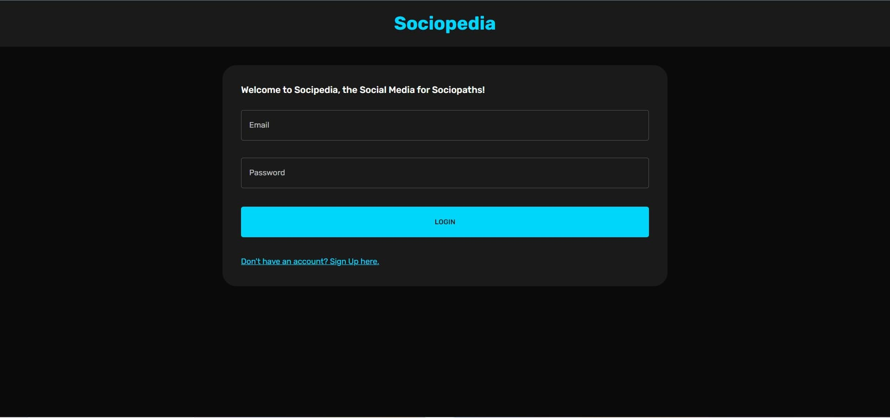
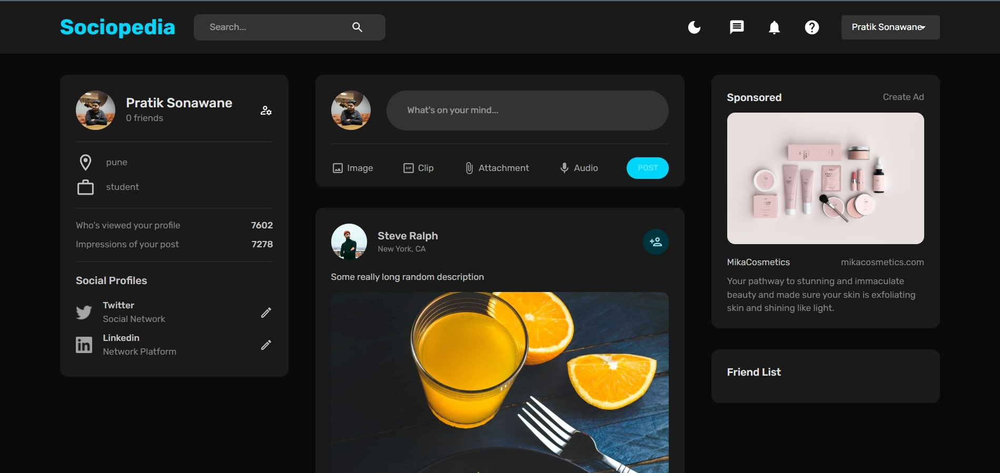
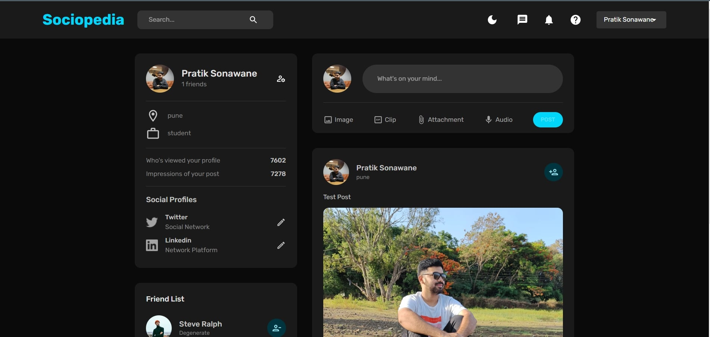

# SocioPedia-The-Social-Media-Application
This application allows users to connect with their friends, family, and the world through sharing text posts, photos, videos, and more. Our platform is designed to be user-friendly and intuitive, making it easy for anyone to join and start sharing their experiences with others.
Our application features include:

  A feed where users can see posts from the people they follow
  A profile page where users can share information about themselves and their interests
  A direct messaging system for private conversations with other users
  A search function to find new users and content
  An easy-to-use post creation interface
  The ability to follow and interact with other users through likes, comments, and shares.
  
<h1>Login Page</h1>

<h1>Register Page</h1>

<h1>Home Page</h1>

<h1>Profile Page</h1>

